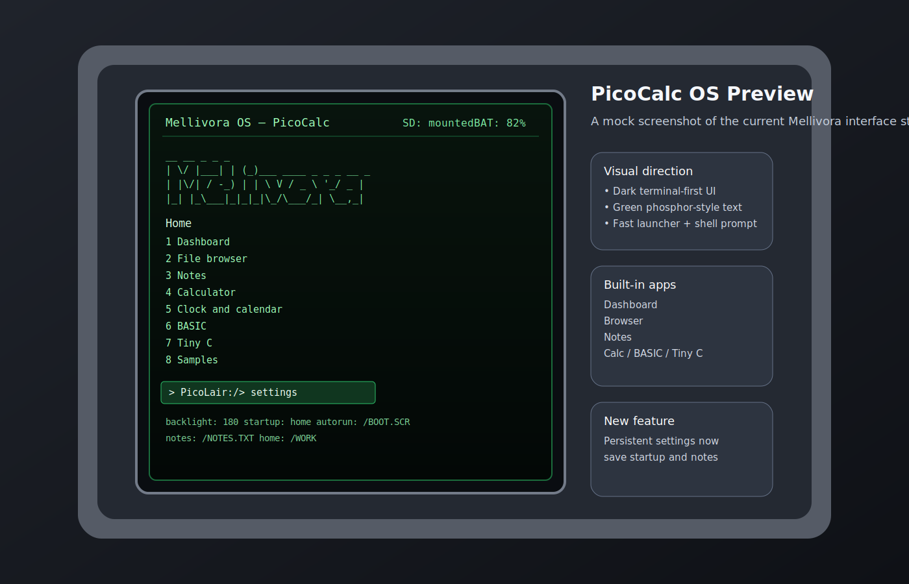

# Mellivora PicoCalc

Mellivora PicoCalc is a keyboard-first micro operating environment for Clockwork PicoCalc style hardware based on Raspberry Pi Pico and Pico 2 boards. It combines a shell, filesystem tools, persistent personal utilities, simple development environments, and lightweight games into a compact firmware image that runs directly on the device.



## Highlights

- text shell with history, aliases, tab completion, command chaining (`;`), output redirection (`>` `>>`), and built-in help
- FAT16/FAT32 SD card storage with file, search, and disk-usage tools
- persistent apps for notes, todo lists, planner, journal, habits (with streak tracking), and bookmarks (with CWD context)
- interactive utilities including browser, editor, hex editor (with byte search), paint, sprite editor, and terminal mode
- text processing: grep (with regex), sort, find, head, tail, cut, wc, and more
- built-in calculator, BASIC environment, and Tiny C environment
- smoother LCD console with optimized scrolling and software key repeat
- launcher, dashboard, system monitor, samples, and mini games including snake (with persistent high scores)

## Quick Start

### Build

From the repository root:

```bash
make picocalc
```

For the Pico 2 variant:

```bash
make pico2
```

For the Pico 2W variant:

```bash
make pico2w
```

Output images:

```text
picocalc/build/mellivora_picocalc.uf2
picocalc/build-pico2/mellivora_picocalc_pico2.uf2
picocalc/build-pico2w/mellivora_picocalc_pico2w.uf2
```

### Flash

1. Put the Pico or Pico 2 device into BOOTSEL mode.
2. Copy the matching UF2 file to the mounted drive.
3. Reboot into Mellivora PicoCalc.
4. Insert an SD card and run `mount` to enable filesystem features.

## Documentation

| Document | Purpose |
|---|---|
| [docs/INSTRUCTIONS.md](docs/INSTRUCTIONS.md) | Fast-start setup and first-use instructions |
| [docs/INSTALL.md](docs/INSTALL.md) | Setup, build, flash, and troubleshooting instructions |
| [docs/USER_GUIDE.md](docs/USER_GUIDE.md) | Day-to-day usage of the shell, tools, apps, and languages |
| [docs/TUTORIAL.md](docs/TUTORIAL.md) | Guided first session from boot to productive use |
| [docs/QUICK_REFERENCE.md](docs/QUICK_REFERENCE.md) | Single-page command cheatsheet |
| [docs/PROGRAMMING_GUIDE.md](docs/PROGRAMMING_GUIDE.md) | Extending the firmware and adding new commands or apps |
| [docs/TECHNICAL_REFERENCE.md](docs/TECHNICAL_REFERENCE.md) | Internal architecture, subsystems, and runtime behavior |
| [ABOUT.md](ABOUT.md) | GitHub-friendly project summary and repository about text |

## Repository Layout

- `picocalc/` — active firmware source tree
- `picocalc/src/` — shell, hardware, filesystem, and app logic
- `docs/` — documentation set
- `Makefile` — root build entry for both Pico and Pico 2 firmware targets

## Project Status

This repository focuses on the PicoCalc firmware target for real handheld hardware. The standard Pico build is the primary path, and a dedicated Pico 2 build is now included for RP2350-based setups. The system is designed around a practical on-device shell workflow rather than a desktop runtime.

See [picocalc/README.md](picocalc/README.md) for the firmware-local overview.
